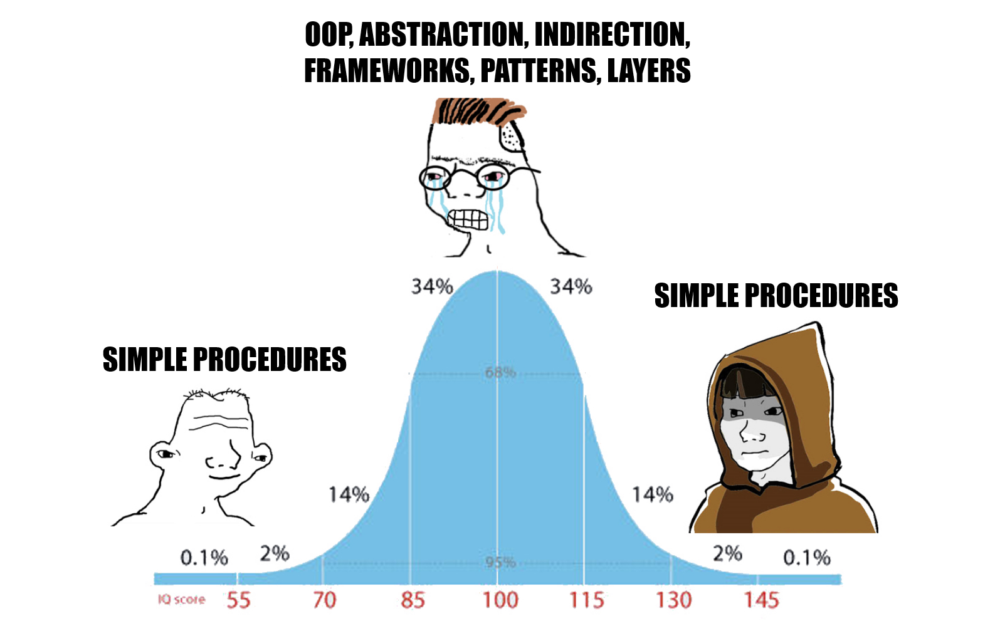

# About This Book

As a programmer, I have always been interested in code readability and how it reflects what it does.

I read Clean Code and other books on good coding practices, and I shared that knowledge.

But I realized that, despite the clean code rules, the source code always became very complicated.&#x20;

I thought a lot about the traps we often fell into and tried to understand the programming habits that lead to overcomplicated code.

I think I have some answers now.

<figure><figcaption></figcaption></figure>

