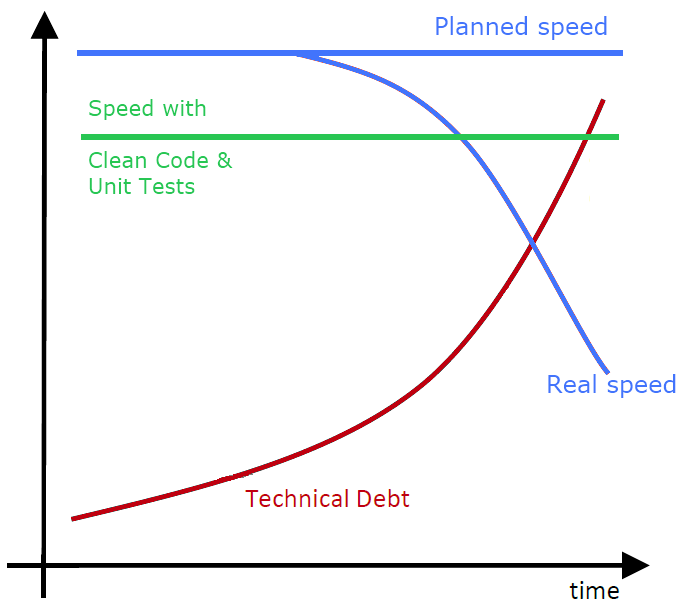
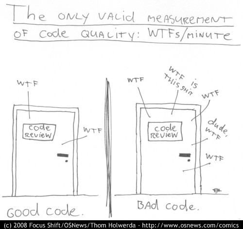

# Origin & Overview

### Uncle Bob & The Book

* [Clean Code book](../clean-code-outline/) &#x20;
* Robert C. Martin a.k.a. _Uncle Bob_ &#x20;

### Named principles

* In the book: SRP, OCP, DIP, (IoC), DI, DRY, LOD, BSR, F.I.R.S.T.
* Not in the book: LSP, ISP, YAGNI, KISS, S.O.L.I.D.

Coding

* **SRP** Single Responsibility Principle
* **OCP** Open Closed Principle
* **DIP** Dependency Inversion Principle
* **(IoC)** Inversion of Control
* **DI** Dependency Injection
* **DRY** Don't Repeat Yourself
* **LOD** Law of Demeter
* **BSR** Boy Scout Rule
* **LSP** Liskov Substitution Principle
* **ISP** Interface Segregation Principle
* **YAGNI** You Ain't Gonna Need It
* **KISS** Keep It Simple Stupid
* **S.O.L.I.D** SRP + OPC + LSP + ISP + DIP

Testing

* **F.I.R.S.T.** Fast, Independent, Repeatable, Self-validating, Timely

### Why clean code?

* [The total cost of owning a mess](../clean-code-outline/why-clean-code.md#technical-debt) &#x20;
* [The real measure of code quality](../clean-code-outline/clean-code.md#possible-measurements) 

### What is bad code like?

Readability

* Spaghetti code
* Dependencies
* Fragile code
* Unreadable
* Mind mapping
* Duplication&#x20;
* Unexpected
* Magic numbers
* Overcomplexity
* Code smell
* Antipatterns
* Technical debt

Functionality

* Bugs
* Does not fulfill the specification
* Side effects

Programmer style

* Careless
* Sloppy
* Lazy
* Quick and dirty

### What is clean code like?

* Elegant
* Simple
* Direct
* Readable
* Expressive
* Carefully written
* Tested
* Bugs cannot hide
* Art

