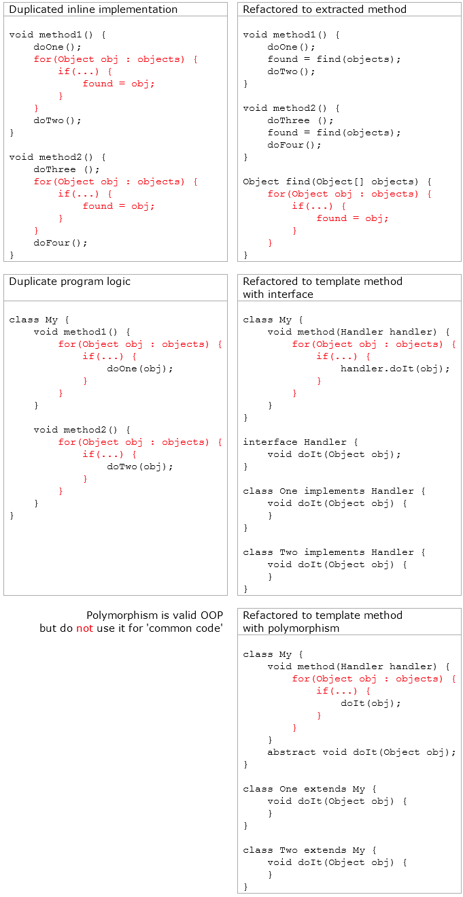
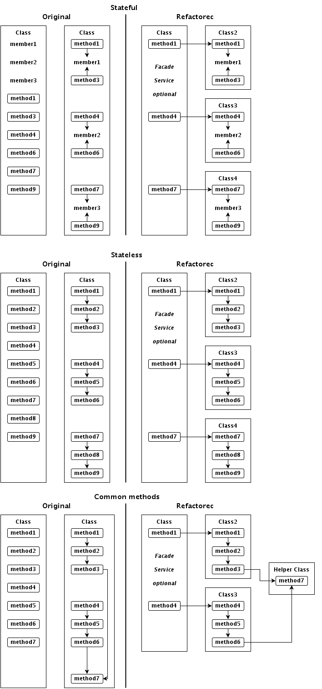
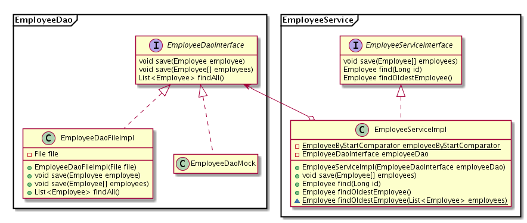

# Typical Issues

## Refactoring

> Refactor a little, code a little

Originally it was good:

```java
getCustomers() {
    return dao.getCustomers();
}
```

Later it is bad: Functionality changed, name not changed

```java
getCustomers() {
    return dao.getCustomers(Status.ACTIVE);
}
```

Good: Name changed

```java
getActiveCustomers() {
    return dao.getCustomers(Status.ACTIVE);
}
```

Good alternative: Declaration changed

```java
getCustomers(Status status) {
    return dao.getCustomers(status);
}
```

## Readability

* It should be readable like "English prose".
* [It should be pseudo code.](../clean-code-outline/clean-code-approaches.md#pseudo-code)

## Names

**Give names!**

* Method level:&#x20;
  * Methods instead of [inline implementations](../clean-code-outline/classes.md#does-more-things-low-cohesion).
* Class level:&#x20;
  * More, small classes instead of big, low cohesive classes.

**Naming struggle is a code smell!**

* If you cannot give a good name.
* Names like 'Abstract', 'Common', 'Base', etc. are not good.

## Duplication

**When general contains special**

Example: Bad: 'Almost the same' methods

```java
public ResultBean saveSomething(InputBean input) {

    logger.info("saveSomething started");
    ResultBean result = new ResultBean();

    ProgressDialog progress = new ProgressDialog(this);

    try {

        // Only this line is different
        Entity entity = SaveCustomer(input, progress);
        result.setEntity(entity);

    } catch (ValidationException e) {
        logger.error("Invalid input: " + input, e);
        throw new BusinessException(e);
    } catch (RuntimeException e) {
        logger.error("Unexpected error", e);
        throw e;
    } finally {
        listeners.sendEvent(SAVE_FINISHED);
        progress.close();
    }

    logger.info("saveSomething returned: " + result);
    return result;
}
```

```java
public ResultBean saveSomething(InputBean input) {

    logger.info("saveSomething started");
    ResultBean result = new ResultBean();

    ProgressDialog progress = new ProgressDialog(this);

    try {

        // Only this line is different
        Entity entity = createIfNotExist(input, progress);
        result.setEntity(entity);

    } catch (ValidationException e) {
        logger.error("Invalid input: " + input, e);
        throw new BusinessException(e);
    } catch (RuntimeException e) {
        logger.error("Unexpected error", e);
        throw e;
    } finally {
        listeners.sendEvent(SAVE_FINISHED);
        progress.close();
    }

    logger.info("saveSomething returned: " + result);
    return result;
}
```

[How to refactor](../clean-code-outline/duplication.md#dry-principle) &#x20;

## Enums

* Use enums for constants
* Static information mapping
* [More...](../clean-code-outline/types.md#enums)

## Classes

**Tight cohesion**

* Single Responsibility Principle
* Members should use each-other
* [How to refactor](../clean-code-outline/classes.md#class-smells) &#x20;

**Loose coupling**

* [Dependency inversion](../clean-code-outline/object-oriented-programming.md#dependency-inversion) &#x20;

**Class types**

Service

* Stateless
* Private members
* Law of Demeter
* DI framework

Data

* No procedures
* New / ORM

**Inheritance**

Problems

* Hard to read, "mind mapping"
* The strongest dependency
* Misunderstanding of polymorphism
  * _A extends B_ reads _A is a B_
  * _A extends AbstractA_ reads _A is an AbstractA_
  * Names smell

Favor composition over inheritance

_From the Effective Java book_

* Use inheritance only for real polymorphism
* Do not put common code into parent classes
  * Leads to low cohesion, SRP violation
* Composition:
  * Methods are the simplest dependency injection
  * Methods are the simplest abstraction
* Turn on warnings

Make methods final

_From the Effective Java book: Design and document for inheritance or else prohibit it_

* Overriding of implemented methods is forbidden
* Fragile code

Links

* [When to avoid inheritance?](../../oop/when-to-avoid-inheritance.md)

## Methods

**Avoid inline implementation**

* Methods doing more than one thing.
* This is unnamed functionality.

Bad: Method doing more than one thing (from the book)

```java
// It does three things
public void pay() {
    for (Employee e : employees) {
        if (e.isPayday()) {
            Money pay = e.calculatePay();
            e.deliverPay(pay);
        }
    }
}
```

Good: Methods doing one thing (from the book)

```java
public void pay() {
    for (Employee e : employees) {
        payIfNecessary(e);
    }
}

private void payIfNecessary(Employee e) {
    if (e.isPayday()) {
        calculateAndDeliverPay(e);
    }
}

private void calculateAndDeliverPay(Employee e) {
    Money pay = e.calculatePay();
    e.deliverPay(pay);
}
```

**Do not return null**

**Do not explicitly pass null**

**Overload methods only if they do the same**

* They physically call the same method
* Only for convenience methods with different parameters

**Do not mix two types of methods**

* Coordinator, "logic"
* Technical

**No side effects**

Take care of invisible side effects

* Transactions
* Concurrency

**Avoid never-ending method chain**

```java
void save() {
    doSomething();
    doSomething();
    doSomething();
    doTheSave();
}

void doTheSave() {
    doSomething();
    doSomething();
    doSomething();
    doReallyTheSave();
}

void doReallyTheSave() {
    doSomething();
    doSomething();
    doSomething();
    nowItComesToTheSave();
}

// etc.
```

## Programmers

* Always ask whether the code does what it should do by the names
* Read back your code
* Check clean code principles
* Avoid workaround programming - against our own code
* Stop & think if too complicated

## Unit tests

* Strictly belongs to clean code.
  * Helps to finish the code units.
* Helps to modify the code: Regressions tests.
* Write unit tests instead of debugging.
* Helps to write testable code.
  * Methods with clear and direct input and output.

## Warnings

* Do not commit warnings!
* Do not hide IDE warnings!
* Do not suppress warnings!

## Antipatterns

**Do not write 'handleError()' methods**

* They does not express the program flow (exception?)
* They cheat the compiler too (unreachable code)
* Instead create a method with return value&#x20;

Bad: What will happen? What does it do? What information is used?

```java
    } catch(Exception e) {
        handleException(e);
    }
```

Good: It is clear

```java
    } catch(Exception e) {
        throw createServiceException(e, ...);
    }
```

