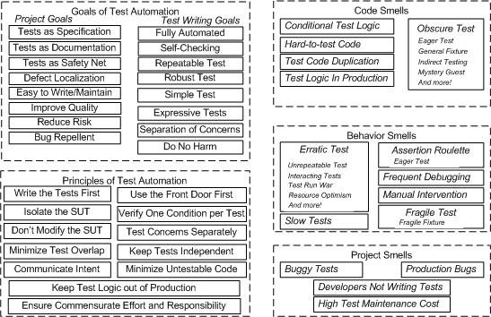

# Unit Tests

It is not part of this document, find only some thoughts here.

> Clean Code = Testable Code

### Rules

* Continuously write unit tests
* Maintain unit test - _keep them running_
* TDD - Test Driven Development
* Tests must be clean too - _they will change with the code_
* Tests must obey the test patterns
* F.I.R.S.T. principles

### Benefits

Enforces to write testable code Makes the code flexible - _changes with regression tests_

### Code coverage

* Try to reach higher levels \(&gt;90%\)
* Do not write tests only for the sake of the code coverage

### Good practices

* Use the default \(package\) visibility for the sake of the unit testing

Unit Testing briefly:

