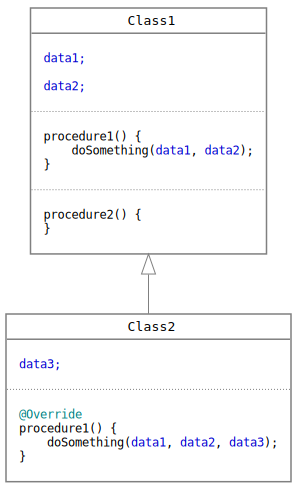
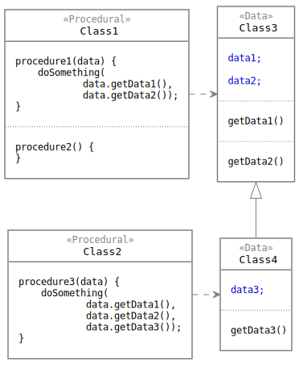
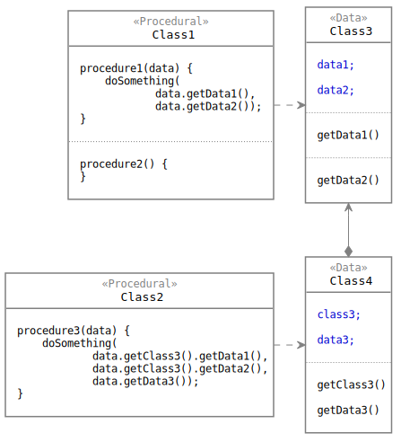
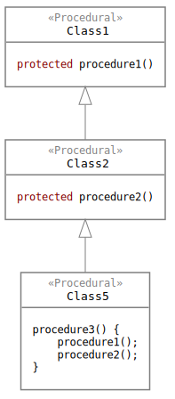
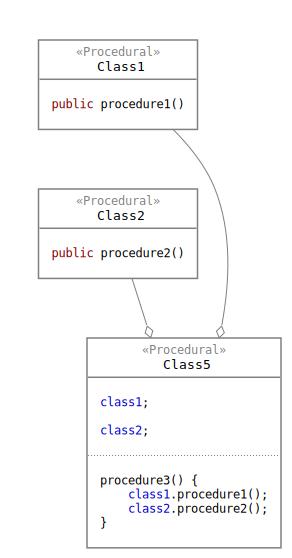
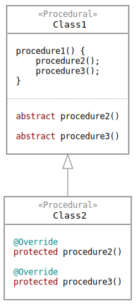
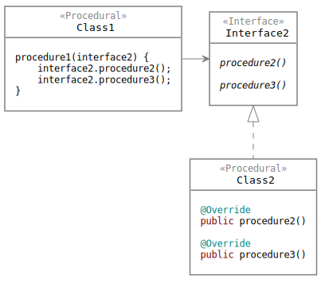
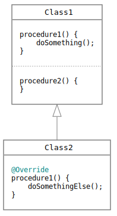
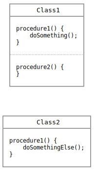

# Do Not Use Inheritance

Inheritance in OOP is the most expensive way of coding. It really makes the code hard to understand and hard to modify. This article does not focus on the issues but the good news: 


We do not have to use inheritance.


So why would we use something which is not so good and there is no need to use it?

There is one reason why inheritance can be avoided. The article describes it and also gives some hints on what to use instead of inheritance.

## Why inheritance was invented

To see why we can avoid inheritance, we should understand why it was invented. The simplified story goes like that:

Before inheritance, there were structural data types, like `struct` in C. 

But developers noticed that for the same data sets they usually needed the same procedures. So they packed the data together with their procedures and called it a `class`.

Then they realized that the data may vary when they model real information. So that some data are the same while some can be different in different use cases. So they invented inheritance, which means that a new class can `extend` an existing one and add new data to the structure. _\(And as the keyword says it should be only an extension and not changes...\)_

But that also means that the procedures packed together with the data should also be variable. And it is not enough to extend the class with new procedures because the existing ones may not correctly handle the new data. So they invented the `override` of existing procedures with new ones.



With `override` things started to be bad so the `abstract` methods have been added finally. These methods are not implemented, so the extending classes will not override any already existing implementation. Since a class with unimplemented methods cannot be instantiated, the entire class also has to be marked as `abstract`. In other words, abstract classes are _designed_ for inheritance.

They called all this together _polymorphism_ and with this, Object-Oriented Programming was born.

As we can see from this explanation:


The reason for polymorphism is that data and procedures were grouped together in a class.


## How we write code today

#### Injection frameworks

With the wide spreading of injection frameworks and the dependency inversion paradigm, we usually separate data and procedures:

* We put data into 'beans', entities, or data transfer objects. Let's call them simply _data classes_.
* Besides that, we add our procedures to stateless singleton classes, i.e. pure _procedural classes_.

The reason is that data types will have multiple instances, while we need only one instance from each procedure. These singleton instances will be then created by the injection framework, which also injects the class dependencies into the instances.


We do not pack data and procedures together anymore.



So we are back at the pre-OOP times with data structures. Back to the future.🙂We do not do classical object-oriented programming as it was invented, so many of its rules are not valid.


We don't have to use polymorphism because its original cause does not exist anymore.


#### Other benefits

Injection is not the only reason to separate data and procedures.

It also makes the code cleaner and more simple by _separating the concerns_. Most applications process data so it should be clear what is the data and what is its processing. 

For procedures we use classes merely to _organize the code_. So we also separate procedures from each-other and group them strictly by their functionality, responsibility, and cohesion.  The code should adhere to the [Single Responsibility Principle](single-responsibility-principle.md).

## No inheritance

Now we have two kinds of classes:

* procedural classes
* data classes

### Procedural classes


We don't have to use inheritance for procedural classes.


If we want to create different procedures for different variations of a data structure, then we can simply write them and put them in a new class. There is no need for inheritance.











When data and procedures are in the same class that means one more thing: the procedures have some 'internal access' to the data variables. But should they have this kind of extra dependency? I think it is perfectly enough dependency to know the public interface of the data class. Procedures should just use their accessors and mutators. If a data structure has information like 'birth date' and it provides that via `getBirthDate()`, what else 'informal' or 'illegal' access does a procedure need to that? 

### Data classes

Should we use inheritance for data classes? Which features of the inheritance could we use?

* `extend`?
* `override`?
* `protected` access?

We do not want data classes to have business logic methods. Why? Because we want them only to carry the data and nothing else. But it means more: we also want that a certain data is this data and nothing else. 

For example, if a data class contains a 'first name' then:

* We don't expect that it changes, disappears, or contains something else.
* We expect an accessor named `getFirstName()` and we don't expect that it returns something else.
* If `getFirstName()` provides only the first name, then it does not need access to other data fields.

The above expectations mean that we should not use `override` to change an accessor during inheritance. And an accessor needs no access to other data members nor `protected` access to the parent class's members. 

The only feature we could use is the _extension_. But this can be implemented with _composition_ instead of inheritance.


We do not have to use inheritance for data classes either.












#### Records in Java 14

In Java 14 the good old _structure_ is brought back with the `record` keyword. This class is defined entirely by the data it carries:

* It features automatically generated accessors, equals, hashcode, etc. 
* It has only getters because all members are automatically `final`.
* The class is not inheritable, it is `final` too.

Read more here:

* [Java 14 – Record data class](https://mkyong.com/java/java-14-record-data-class/)
* [JEP 359: Records \(Preview\)](https://openjdk.java.net/jeps/359)

## Coding without inheritance

Now we talk only about procedural classes. 

How should we solve the situations we used to implement with inheritance? How can we refactor inherited classes to no-inheritance code? I have identified two common use cases, which I simply call:

* Children call the parent.
* Parent calls the children.

Of course, in real life we usually see the two cases mixed.

### Children call the parent 

This means that the descendant classes simply use the methods they inherit from their parent classes.

In this situation the solution is already given by the [Effective Java](overviews/effective-java-toc.md) book:


Favor composition over inheritance


We should turn the parent classes into _components_ and inject them into the former child classes.

Probably we should not use the parent classes as they are, but rather refactor them into more components by functionality and cohesion. This also makes the code more clear.











### The parent calls the children

#### Abstract methods

Parents usually call their children via abstract methods. It is the [Template method](https://en.wikipedia.org/wiki/Template_method_pattern) design pattern.

An abstract class practically defines a new interface with its abstract methods. This interface must be implemented by the child classes. _\(This is one reason why it is easy to get lost in a class hierarchy. The children implement totally different interfaces, and when we traverse down in the hierarchy we quickly get far from the original interface...\)_

The solution for this also comes from the [Effective Java](overviews/effective-java-toc.md) book:


Prefer interfaces to abstract classes


So move the abstract methods into one or more interfaces. Any class that implements these interfaces can be used by the former parent classes.











This also means that classes are free to implement the interfaces in their own way, without strictly adhering to the parent classes' abstract and inherited methods. Not to mention the inherited injected classes. So it frees us from a big disadvantage of inheritance. A class simply needs that an interface is implemented without telling _how_ it is implemented.

#### Overridden methods

Not surprisingly the [Effective Java](overviews/effective-java-toc.md) book has something to tell about this too:


Design and document for inheritance or else prohibit it


Practically it means that all implemented methods should be `final` or `private`. In other words, overriding an already implemented method is firmly not recommended. _\(I would say, it is forbidden.\)_

Anyway, if there are overridden methods, it is no problem. That is the goal of the coding without inheritance: if we needed to override a method then we simply move the new implementation into a class and call it when it is necessary.











### Procedural classes should be final, but...

Also referring to this rule from the [Effective Java](overviews/effective-java-toc.md) book:


Design and document for inheritance or else prohibit it


It means that we should disallow the overriding of already implemented methods with the `final` keyword. But we want to disallow inheritance in general for procedural classes, so we should make the entire class `final`.

Unfortunately, both final classes and final methods make the mocking impossible in unit tests. That's why we cannot apply this rule, despite that it would be very good.

So from clean code's point of view, procedural classes should be final, but it is not possible because of our unit testing methods and tools. Anyway, we should keep this rule in mind, in case we can overcome the mocking issues.

## The new guidelines for coding

Let's summarize the guidelines so that they can be followed and also checked during the coding.

### Always separate data and procedures into distinct classes. 

This is a pre-condition to write no-inheritance code.

Unfortunately, there is no syntactical difference between procedural and data classes:

* they are both classes
* they both have members \('instance variables'\)
* they both have procedures

But they are very different, so different rules should be applied to them.

### Rules for procedural classes

#### Procedural classes should not contain data

In other words, they should be stateless.

Injected references to other procedural class instances do not represent states, since they will never change through the lifetime of the class. And these references do not represent 'data'.

#### Procedural classes should not be polymorphic

They should not use inheritance because they don't have to use it.

According to the _Occam's razor_ principle if we do not need to use it - and it is very expensive and complicated too - then we must not use it.

#### Procedural classes can implement interfaces

As discussed above, abstract methods should be replaced with interfaces. So we should use interfaces for procedural classes in one certain situation:

* A framework can call procedural modules via an interface. This solution should be used instead of the "The parent call the children" case, see above.

Interfaces do not have the disadvantages that parent classes have:

* Interfaces methods have no implementation so implementer classes cannot override existing implementation.
* Interfaces do not make it possible to create multiple inheritance. \(At least in Java.\)
* Interfaces require only what to implement but not how they are implemented. 

One procedural class can implement only one interface. Why?

* A class has one reason to exist. When implementing an interface this reason is to implement it, in order to be a part of a certain framework. It should not be part of another framework. If the code in these classes should be reused then they can be used directly or refactoring is needed to extract the necessary functionality.
* Ideally, a normal procedural class—i.e. which is not a collection of utility methods—should have exactly one public method as an "interface", whether it implements an interface or not. What would it mean to implement another interface? Would it be just the renaming of that one method? I think we should not do this.

### Rules for data classes

#### Data classes should not have real procedures 

More precisely they should not contain procedures that 

* process data
* create data
* implement business logic

Data classes may have procedures that are

* constructors, accessors, and mutators \('getters and setters'\)
* simple and inherently meaningful for the given data structure

For example, if the data class contains a map then it is logical to have an accessor by the map key:

```java
class MyData {

    Map<String, Object> itemsByCode;
    
    Object getItem(String code) {
        return itemsByCode.get(key);
    }
}
```

#### Data classes should not implement interfaces

Implementing an interface means that the class is free to implement its methods in a necessary way.

Are data classes free to implement methods in different ways? What implementation can have a method like `getFirstName()` other than the data structure really contains the first name?

You may say, data classes could implement interfaces and this is some kind of adaptation [design pattern](https://en.wikipedia.org/wiki/Software_design_pattern). But it would mean that we adapt the data to a certain process and its classes. _But wait..._ Don't we write the procedures for the data? Shouldn't we adapt the procedures to the data structures? More precisely, we create the procedures for certain applications and data so they are already 'adapted'.

You may say, this is the [Interface Segregation Principle](https://en.wikipedia.org/wiki/Interface_segregation_principle). _"A client should not depend on more methods than it uses."_ But I think it comes from the classical OOP where data and procedures are put together in the same class. In our new OOP we strictly separate them and get new chances to simplify the coding. A data structure is nothing else but a data structure as it is.


If a client procedure uses a data structure then it should depend on it and use it as it is.


### Rules for interfaces

#### Interfaces should not extend each other

We want to get away from inheritance with classes. We should not repeat it with interfaces either.

#### Procedural classes can implement only one interface

See the explanation above.

#### Data classes should not implement interfaces

See the explanation above.

### Forbidden keywords

#### Keywords that should never occur

The following inheritance-related keywords can never occur in the code:

* `abstract`
* `extends`
* `protected`

It is possible to set up a static code checker to simply check these words in the code.

#### Keywords that can occur only in limited situations

The following keywords can be used only in procedural classes since they can implement interfaces:

* `implements`
* `override`

Actually, the `override` keyword should be something else in this case, just like `extends` and `implements` are different. For example, these keywords should be `override` and `implement` respectively. In this case, we could add `override` to the list of the forbidden keywords. 

