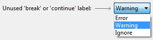

# How To Handle Warnings

In every software project, there is a moment when the team decides to install a Sonar server and to do something with warnings in order to increase code quality. _**But all of the teams will fail.**_ This is a typical scenario:

* We work on the software for a long time, until the first or second "big release".
* One or two years after the project start we install the Sonar server.
* The first shock comes when we see the high number of warnings, which is usually 10–20 thousand.
* We realize that we have no chance to fix them, so we come up with a strategy to decrease the number of warnings. Usually by fixing the critical and major issues first.
* We get the second shock after half or one year again when we see that nothing happened with the warnings. Their number has even increased.

Does it sound familiar? Let's see what are here the mistakes, and the lessons learned. Finally, I suggest a new way when dealing with this situation.

### Take care of warnings from the project start

The most obvious mistake that the Sonar—or, more generally, the _controlling of warnings—_is started when it is too late: when there are way too many of them.

Many other measures and tools are in use right from the project start: version control system, continuous integration, unit tests, behavioral tests, bug tracking system, documenting tool, etc. Except for the checking of warnings.

### Do not hide warnings in the IDE

This is the most painful one. Developers do not turn on the displaying of warnings in their local development tools. They hide the warnings, so _they continuously commit a lot of warnings_ all the time. So while they are talking about how to decrease their count, they still increase it.

Unfortunately, the default setting of IDEs is that warnings are turned off, suggesting that this is the good approach. But it is not. I recommend that the "default setting" should be to turn on all of them. And then the team can agree on a few ones that should be ignored.

### Understand what warnings are

It seems that warnings are still the stepchildren of software development. Something annoying that can be ignored. The root problem is that we probably do not understand what warnings are.

Warnings point to real problems in our source code. _Warnings are potential bugs._ Actually, they _are_ bugs because most of the bugs are caused by incorrect code parts, which could be detected via warnings.

Moreover, warnings point to deeper structural problems in the code, which are not simple to fix. Probably that is why we do not like them. (For example, unused parameters are usually a sign of bad class hierarchy.)

There is no fundamental difference between warnings and errors! They differ only in the arbitrary level that we assign to them. You can even set it in your IDE:

And I do not have to mention that warnings should not be fixed via `SuppressWarnings`...

### Add code checkers to your IDE

I have heard this buzzword many times: _"We will turn on Sonar"_, suggesting that after this everything will be fine. But it will not, since Sonar will not fix the warnings only show them.

What does the Sonar server exactly do?

* It executes some static code checkers and displays their results. The code checkers are usually these ones: _CheckStyle_, _FundBugs,_ and _PMD_.
* It executes the code checkers on the code which is already committed into the version control system.

These static code checkers are also available as plugins for our IDEs. So I simply suggest installing them locally at the developers and execute them prior to the commits at least on the new or modified code parts. So we will not commit "Sonar warnings" anymore!

### Always keep warning count on zero

We have a strict rule that the code base committed to the repository must contain 0 compilation errors. We also require that the count of failing unit tests is also 0, so if there are any, they must be fixed immediately. We should deal with warnings in the same way.

A simple "psychological" reason is that nobody will notice if the warning count changes from 16482 to 16492, but it is easy to detect a change from 0 to any number.

I suggest applying this approach even when we start to check warnings in the middle of the project, when we have tens of thousands:

1. Turn off all warnings for all modules at first.
2. Decide to clear one warning level or one warning type or one code module.&#x20;
3. Turn on warnings only for this.&#x20;
4. Fix the warnings immediately.
5. Repeat from step 2.

With this approach we do not have to fix all warnings, we can stop if we are already satisfied with the status. But even in this case, _all_ warnings must be fixed for the new and modified code parts!

### Execute your plan

There is one more thing missing from the scenario at the beginning: The tasks, related to the handling of warnings, are not addressed, i.e. the plan to decrease them is simply not executed. For this I recommend a simple method I learned from the quality management systems:

#### PDCA Cycle

* Plan:
  * Create an execution plan.
  * Plan the results to be reached.&#x20;
  * Plan how to measure them by numbers if possible.
* Do:
  * Assign resources.
  * Execute the plan.
* Check:
  * Check the results.
  * Measure the numbers.
* Act:
  * Review the whole thing, whether it yields the desired results.&#x20;
  * If not, change it.

### Ignore warnings?

As I see the software industry simply does not need the code quality above a certain level. Customers and stakeholders do not want more _clean code_ or fewer warnings. Maybe these things seem to be unnecessary or too expensive.

In this case, it can be a valid solution that we simply ignore all warnings in the code. But then we should not bother to install Sonar and watch the high number of warnings.

