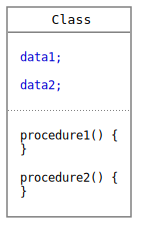
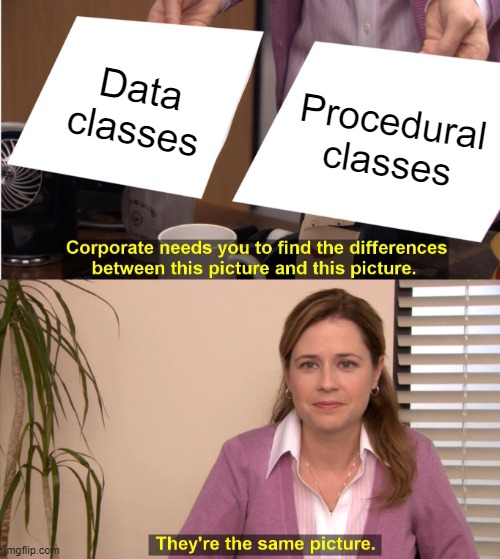

# Separate Data And Procedures

### Classes

Before classes, there were procedures and data. Data could be structured data. In C they are called `struct`.

But developers noticed that for the same data sets they usually needed the same procedures. So they packed the data together with their procedures and called it a `class`.

So a class contains:

* member variables - I call them now 'data'
* member functions - I call them procedures

 

But was it really a good idea?

### Impossible Mission

Thinking of a large, real-life code base, is it possible to put really _all_ codes into the class where the data is located? I think, no. It would mean huge classes. We never do it.

It would also mean, that the same classes would change again and again. Every developer would always work on the same few classes.

### Clean Code

From a clean code aspect, bundling data and procedures is not a goal either. 

We would like to organize our code by features and not by data. We want to create many small and independent classes. 

Procedures should also have well-defined input and output data, rather than being coupled with the data. When they are coupled with the data, which they read and write at the same time, then it is impossible to make a distinction between input and output data.

### Dependency Injection

The final nail in the coffin of the class is the widespread use of dependency injection. We _already_ separate data and procedures and handle them in different ways.

* We use procedures in stateless singleton classes, which are instantiated by the injection framework.
* We used to organize data in domain models or data models. They should not contain business logic.

So we used to have these types of classes:

|  | Procedural | Data |
| :--- | :--- | :--- |
| _Statefulness_ | stateless | stateful |
| _Cardinality_ | singleton | prototype |
| _Instantiation_ | by injection framework | by application, ORM framework, etc. |

### No Classes


Separated procedural and data classes are no classes!


According to the original concept of classes, these are no classes at all, since they don't couple data and procedures.

Unfortunately, today's languages like Java or C++ still call them classes. Not only the keywords are the same, but they both seem to have data and procedure members. So, by the syntax, there is no difference between them. 

The reason is simply, that they are _class-based languages_. Everything is a class. That's why we, programmers still treat them as classes.

 

Here is what we have by syntax:

|  | Procedural | Data |
| :--- | :--- | :--- |
| _Name_ | `class` | `class` |
| _Data members_ | Yes | Yes |
| _Procedure members_ | Yes | Yes |

Do procedural classes really have data members? No. They have only other components injected. Does it make them stateful? Well, yes, but we just don't use to change the injected components. _So we use them differently as they are intended_.

Do data classes really have procedural members? No. They have only accessors and mutators \(getters and setters\). They do not add any new information to the class besides accessing the data members. Does it make them having procedures? Well, yes, but we just don't use to write procedures in them. At least no complex business logic. _So we use them differently as they are intended_.


We misuse data members in procedural classes and procedural members in data classes.


Why do we do this? Because we don't have other choices due to the syntax.

### Java Records

In Java 14 the data _structure_ is brought back with the `record` keyword. This class is defined entirely by the data it carries:

* It features automatically generated accessors, equals, hashcode, etc. 
* It has only getters because all members are automatically `final`.
* The class is not inheritable, it is `final` too.

Read more here:

* [Java 14 – Record data class](https://mkyong.com/java/java-14-record-data-class/)
* [JEP 359: Records \(Preview\)](https://openjdk.java.net/jeps/359)

This also supports the idea that data classes are no classes, and it also gives a new language keyword for them.

### The New Classes

We should see and treat separated data and procedural classes as something new. What if we would at least 'imagine' different names for them?

* Procedural classes could be called _units_. That would immediately make clear what we test via unit testing.
* Data classes could be called _records_. I have just taken the name from the new Java records.

So here is what we have in reality:

|  | Procedural | Data |
| :--- | :--- | :--- |
| _Name_ | `unit` | `record` |
| _Data members_ | No | Yes |
| _Procedure members_ | Yes | No |
| _Statefulness_ | stateless | stateful |
| _Cardinality_ | singleton | prototype |
| _Instantiation_ | by injection framework | by application, ORM framework, etc |

### No OOP

[Object-oriented programming](https://en.wikipedia.org/wiki/Object-oriented_programming) is based on traditional classes. Should we still do OOP if we have no more classes? Logically, the answer is no.


If we separate procedural and data classes, we should not write programs in a classical OOP way. We should also revise all OOP principles, which are no more valid.


I another article I suggest to [not use inheritance](do-not-use-inheritance.md) anymore.   

* With this, most of the _encapsulation_, _polymorphism_, and _open-closed_ principles are gone.
* Many [_design patterns_](https://en.wikipedia.org/wiki/Software_design_pattern) that use inheritance become unusable. Or we should redesign them without inheritance.
* Some other rules, like the _dependency inversion_ principle, can remain valid. \(Allowing the usage of interfaces.\)
* There can be ones, like the _law of Demeter_, which will be valid either for the procedural or the data classes.

#### Law of Demeter

As an interesting example, let's take a look at the [LoD](https://en.wikipedia.org/wiki/Law_of_Demeter). It is also simplified as a "dot counting rule". So we should not write the following code:

`getContractService().getUserService().getAddressService().getAddress()`

It is still valid for procedural classes. What about data classes?

If we process a data structure then we need to know the entire structure. That's why it was created for. The following kind of code is very common and perfectly valid:

`getContract().getUser().getAddress().getZipCode()`

There are long articles on the internet struggling with this issue and sometimes coming close to the solution, that LoD is not useful when we access data members.

### Further Reading

* [Criticism of OOP](https://en.wikipedia.org/wiki/Object-oriented_programming#Criticism) in the Wikipedia article.
* [Do Not Use Inheritance](do-not-use-inheritance.md)

