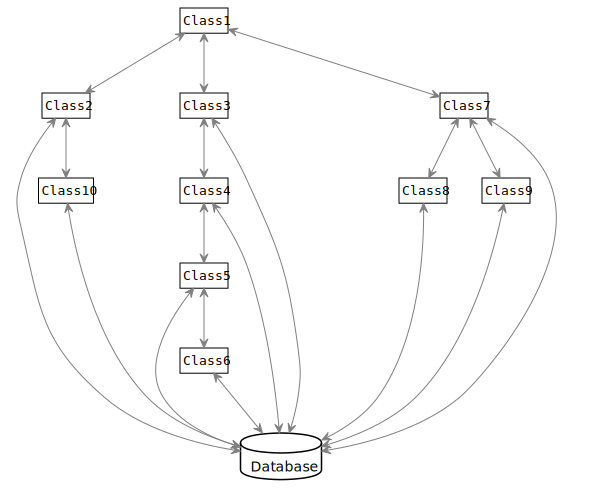
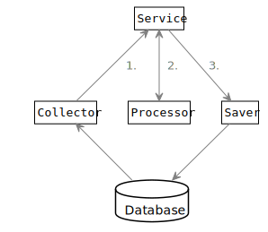
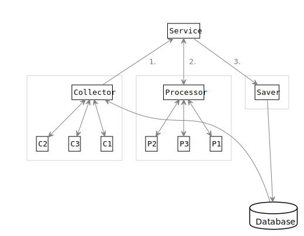

# Separate Data Collection And Processing

Do you remember this little numerical "machine" from the ground school?

It shows the kids an operation, like multiplying numbers by 2. It is actually a _function_ with input and output values, and it seems to be a basic element of programming too.

## The Problems With the Architecture

Now let's take look at how we write our programs today. Every arrow on the image is a data flow between the components:

Can you find the little machine in this image? No, you cannot, because it is not there. On the UML image, it should look like this—with only one arrow:

 

Why is it a problem? What's wrong with our code above? There are more issues:

#### Unclear Input And Output

The components do not have clean input and output data. Instead, they can read and write the database anytime. Or, they can ask other components to provide more data in any step of the processing.

#### Unreliable Data Fragments

This also means that the data, which is processed, is never complete. It is never finished, so it is always _unreliable_.

#### Components Don't Return Properly

Sometimes, components really don't have a clear return point, so they cannot return their output data. Instead, they pass their results forward to other components.   
  
I call it the [never-ending chain](overviews/clean-code-introduction/typical-issues.md#methods) antipattern. See `Class3` to `Class6` on the image as an example.

#### Breach of SRP

The _single responsibility principle_ seems to be broken as well. All classes do at least two different things: 

* collect the data
* process the data

These activities are usually mixed within methods. Each method may collect and process the data. So even the methods breach the SRP.

## Separate Data Collection And Processing

To fix the architecture, we should clearly separate the two steps:

* collect the data first
* then process it



 







## Create Data Objects

Actually, the data should be immutable, so that it cannot be modified during the processing. When the processing generates more data, then it should be stored into other data objects, designed for the output.

#### Use Composition Instead of Inheritance

If some data are already collected, then they can be added to larger data structures without any change.

You can even embed database entities, which are already detached from the database. \(In the terms of Hibernate.\)

#### Treat Data As Immutable

Create all data once, via constructors—and factory methods—and don't change them after that.

The best would be to make all data immutable, but it is quite cumbersome. Luckily, the immutable _records_ have been added to Java 14. They are designed exactly for this purpose.

#### Avoid Maps

