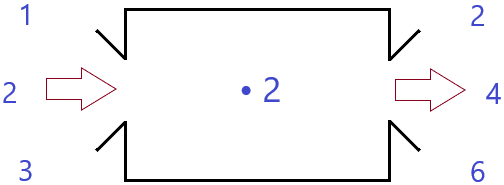
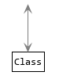

# Separate Data Collection And Processing

Do you remember this little numerical "machine" from the ground school?

It shows the kids an operation, like multiplying numbers by 2. It is actually a _function_ with input and output values, and it seems to be a basic element of programming too.

## Problems With the Architecture

Now let's take look at how we write our programs today. Every arrow on the image is a data flow between the components:

Can you find the little machine in this image? No, you cannot, because it is not there. On the UML image, it should look like this—with only one arrow:

Why is it a problem? What's wrong with our code above? There are more issues:

#### Unclear Input And Output

The components do not have clean input and output data. Instead, they can read and write the database anytime. Or, they can ask other components to provide more data in any step of the processing.

#### Unreliable Data Fragments

This also means that the data, which is processed, is never complete. It is never finished, so it is always _unreliable_.

#### Components Don't Return Properly

Sometimes, components really don't have a clear return point, so they cannot return their output data. Instead, they pass their results forward to other components. \
\
I call it the [never-ending chain](../overviews/clean-code-introduction/typical-issues.md#methods) antipattern. See `Class3` to `Class6` on the image as an example.

#### Breach of SRP

The _single responsibility principle_ seems to be broken as well. All classes do at least two different things:&#x20;

* collect the data
* process the data

These activities are usually mixed within methods. Each method may collect and process the data. So even the methods breach the SRP.

## Separate Data Collection And Processing

To fix the architecture, we should clearly separate the two steps:

* collect the data first
* then process it















Of course, each part may consist of more steps, i.e. more classes. In this case, the classes should be designed as a function, with clear input and output. See the _Sub-steps_ image.

In other situations, there may be more big steps of processing, where the output of one step is the input of the next step. In other words, we can have more processors. They should be implemented as functions too. See the _Multiple_ image.

#### Separate Write And Read Phases

The separation of the collection and the processing aims also the separation when the data is written and when it is _only_ read:

* Collection: Write-only
* Processing: Read-only

Of course, the processing step will create its own output data, and that is in the write-only phase in the processor.

## Create Data Structures

The next thing we need to do besides the separation is to design the input and output data structures for each step. For this, we should create _data transfer objects_ (DTOs).

See more in the next chapter, [how to create data structures](create-data-models.md).
