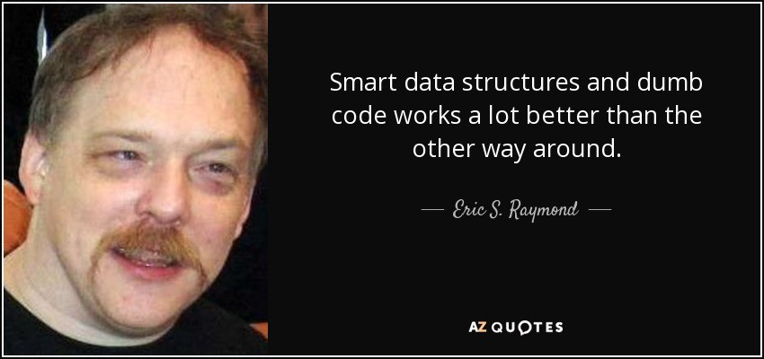

# Create Data Models

### Design Input And Output Data

We used to design the overall data model of the application, i.e. the entities in the database, which we refer to as a _domain model_. But since we have to implement independent features and components, we should do more:

* Carefully design the data flow within every feature.
* Clearly define the input and output data for each component.

### Data Transfer Objects (DTOs)

For this, we should create _data transfer objects_. These are data classes that only carry data and do not contain procedures implementing business logic.

Here we benefit from the method that we [separate procedural and data classes](../oop/separate-data-and-procedures.md). See more in that chapter.

### Data Model

Every data structure we create is a _data model_. Its strength is that it _models_ the data. The better we can describe the data, the clearer it tells what should be processed.

> Imagine that you have to create complex Excel files programmatically. The files may contain not only rows and columns but also multiple sheets, sub-tables, row groups, column groups, and other complex structures. You should model the Excel content with data structures as precisely as possible.

### Use Composition

Of course, data structures are made up of other data structures and data classes, down to single attributes. How should we build them efficiently?

#### Do Not Copy

If some data structures are already collected, whose attributes we need, we should not create new classes with the demanded attributes, and copy their values. Instead, we should simply add the already collected data as a whole to our new data objects. (Of course, only if there is no objection against it, like memory consumption or others.)&#x20;

I would simply call it _embedding_ a data structure into another one.











With embedding, we can reach, let's say, `attribute9` with the following expression:

`data4.getData1().getData3().getAttribute9()`

We should avoid copying attributes because it requires more procedural code and possibilities for mistakes. With composition we have the following benefits:

* It is simpler to put together the new data structures.
* There is no need to change the existing data. (It should be treated as immutable, see below.)

#### Do Not Inherit

For the same reason as in the case of copying, _inheritance_ is not useful either. With this, the attributes are inherited only on type level, but on object level (in runtime) we still need to copy them.

Alternatively, if we declare the first data structure already for the new, extended data type, then we have to fill the extra attributes later, in a second step. This contradicts our goal to treat the data as immutable. (See more in the next chapter.)







We should not use inheritance in data objects anyway, as described in this chapter: [Do Not Use Inheritance, _Rules For Data Classes_](../oop/do-not-use-inheritance.md#rules-for-data-classes).

#### Embed Entities

You can even embed database entities if the memory consumption does not speak against it.&#x20;

It is recommended that they are detached from the database, in the terms of Hibernate. This simply means that we use the entities outside of the original reading transaction. In this way, they simply become 'data transfer objects' and we can add them to other DTOs.

### Treat Data As Immutable

This has key importance to solve the problem that is described in [Separate Data Collection And Processing](./). We want to clearly separate the writing and the reading of all data to make our code clean.

Actually, the data should be immutable, so that it cannot be modified during the processing. When the processing generates more data, then it should be stored into other data objects, designed for the output.

Create all data once, via constructors—and factory methods—and don't change them after that.&#x20;







This also comes in handy when we use our components in functional programming.

```java
inputs.stream()
    .map(Processor1::process)
    .map(Processor2::process)
    .map(Processor3::process)
    .collect(toList());
```

### Use Records

In Java 16 the `record` keyword has been introduced. (From Java 14 as a preview feature.) Records implement everything, which is written above, and we don't even have to declare a class for them in the old way! &#x20;

* Records can be created simply from instances of data objects or other records. No need for class declaration.
* Accessors ('getters') will be automatically generated, and they do nothing else but return a property value. They cannot be overridden either.
* Records have no mutators ('setters') at all. If records are composed of other records then the result will be close to _read-only_.
* The class does not support extension and inheritance, it is `final` too.

Read more here, or find tutorials on the internet:

* [Java 14 – Record data class](https://mkyong.com/java/java-14-record-data-class/)
* [Java 14 – JEP 359: Records (Preview)](https://openjdk.java.net/jeps/359)
* [Java 15 – JEP 384: Records (Second Preview)](https://openjdk.java.net/jeps/384)
* [Java 16 – JEP 395: Records](https://openjdk.java.net/jeps/395)

### Put Together What Belongs Together

When collecting the data that should be processed do not simply create collections. If those collections contain data related to each other then create a DTO that holds them together.

Let's say every A has a B and multiple C-s.



```java
Collection<A> as;
Collection<B> bs;
Collection<C> cs;
```



```java
class ADto {
    A a;
    B b;              // b  belonging to a
    Collection<C> cs; // cs belonging to a
}

Collection<ADto> as;
```



In other words, you should _finish_ the preparation of the input data before the processing of the data.

#### Avoid Maps

The same goes for Maps.

Maps are inherently _unfinished_ data structures. Despite having all objects mapped to their keys, the processing code must complete the mapping by getting an object by the key. And if we need the mapped object in multiple code parts then it must do the same mapping again and again, which is code repetition.



```java
Collection<A> as;
Map<A, B> bs;

void process1(A a, Map<A, B> bs) {
    B b = bs.get(a);
} 

void process2(A a, Map<A, B> bs) {
    B b = bs.get(a); // code repetition
} 
```



```java
// Data model

class ADto {
    A a;
    B b; // b belonging to a
}

Collection<ADto> as;

// Data creation

ADto createADto(A a, Map<A, B> bs) {
    return new ADto {
        a;
        B b = bs.get(a); // do it only once
    }
}

// Data processing

void process1(A a) {
    B b = a.getB();
} 

void process2(A a) {
    B b = a.getB();
}
```



### Use Factories

If certain data can be created in different ways, then use factory classes and methods to create them, instead of using multiple constructors. This is important for more reasons:

Unlike constructors, factory methods have _names_. There is no clean code without names. Names describe the business logic, the program implements.

The other reason is obvious from the article [Separate Data And Procedures](../oop/separate-data-and-procedures.md). For the data creation, we may need specific procedures and other components, including the database. These procedures and dependencies cannot be added to the DTO classes. Data classes should only carry the data and should not contain procedures.

A simple way to create a factory class for every DTO. If the data creation consists of more components then the classes should be in a separate package, according to the Single Responsibility Principle.&#x20;



```java
package data;

class User { ... }
class UserFactory { ... }

class Contract { ... }
class ContractFactory { ... }
```



```java
package data;

public class User { ... }
public class UserFactory { ... }

package data.contract;

public class Contract { ... }
public class ContractFactory { ... }
class ContractIdGenerator { ... }    // note the visibility
class ContractValidator { ... }      // note the visibility
```



If more classes are needed to create certain DTOs, place them together with the factory classes and use the _package private_ (default) visibility. (See the example above.)

When using factory methods, use _only one constructor_ for the DTO that requires all attributes.

When using _records_ as DTOs (see above), we don't need to explicitly declare data classes. But in this case, we can still keep the factory classes.

### Advantage In Testing

Creating clear input and output data for the components completely changes the unit testing, making it easier and more clear.&#x20;

Instead of mocking the used components, we should simply create the data classes that serve as input. The same goes for the expected output if that's a well-defined data structure too. We should create the expected output and compare them with the actual one.&#x20;

We can also implement the `equals()` methods of every class, so that we can simply test the classes for equality. Or, we can provide comparators if the testing needs a different comparison than the runtime equality. With records we will get the equality based on the data content, so the runtime comparison won't differ from the testing.

```java
public void testSomething() {
    Offer offer = new Offer(
                           new User(...),
                           new Template(...));
                        
    Contract countractActual = contractService.createContract(offer);
    
    contractExpected = new Contract(
                           new Contractor(...),
                           new ContactPerson(...));
    
    Assert.assertEquals(contractExpected, countractActual);
}
```

### Avoid DTO Hell

Will we not have too many DTOs in the way as written above? In other words, won't we have a "DTO hell"?

Yes, we may have many new classes. Factories can also increase the number of classes. Good news is that using records can decrease it.

But there is one important point because we would like to write clean code. We don't have to consider all DTOs together as a "big bunch" of classes. We should organize the code by business logic, we should separate features.&#x20;


Do not create a global _dto_ or _model_ package to collect all data classes from different features.


So for a certain modification of the code, we need to focus only on one feature's classes, which are independent of the others.



