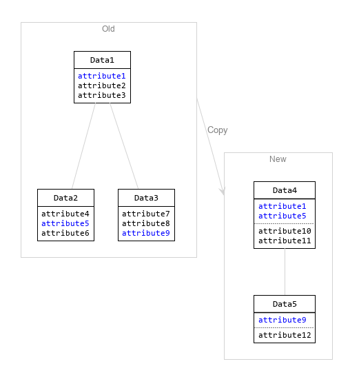
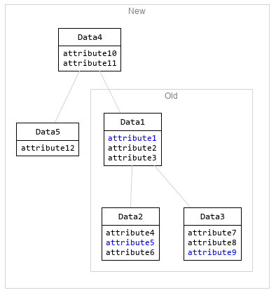
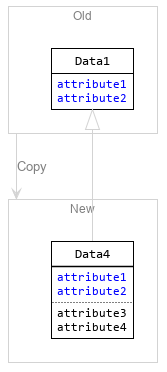
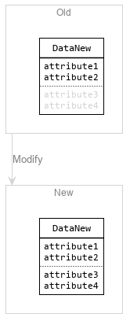

# Create Data Models

We used to design the overall data model of the application, i.e. the entities in the database, which we refer to as a _domain model_. But since we have to implement independent features and components, we should do more:

* Carefully design the data flow within every feature.
* Clearly define the input and output data for each component.

### Data Transfer Objects \(DTOs\)

For this, we should create _data transfer objects_. These are data classes that only carry data and do not contain procedures implementing business logic.

Here we benefit from the method that we [separate procedural and data classes](../separate-data-and-procedures.md). See more in that chapter.

### Data Model

Every data structure we create is a _data model_. Its strength is that it _models_ the data. The better we can describe the data, the clearer it tells what should be processed.

> Imagine that you have to create complex Excel files programmatically. The files may contain not only rows and columns but also multiple sheets, sub-tables, row groups, column groups, and other complex structures. You should model the Excel content with data structures as precisely as possible.

### Use Composition

Of course, data structures are made up of other data structures and data classes, down to single attributes. How should we build them efficiently?

#### Do Not Copy

If some data structures are already collected, whose attributes we need, we should not create new classes with the demanded attributes, and copy their values. Instead, we should simply add the already collected data as a whole to our new data objects. \(Of course, only if there is no objection against it, like memory consumption or others.\) 

I would simply call it _embedding_ a data structure into another one.











With embedding, we can reach, let's say, `attribute9` with the following expression:

`data4.getData1().getData3().getAttribute9()`

We should avoid copying attributes because it requires more procedural code and possibilities for mistakes. With composition we have the following benefits:

* It is simpler to put together the new data structures.
* There is no need to change the existing data. \(It should be treated as immutable, see below.\)

#### Do Not Inherit

For the same reason as in the case of copying, _inheritance_ is not useful either. With this, the attributes are inherited only on type level, but on object level \(in runtime\) we still need to copy them.

Alternatively, if we declare the first data structure already for the new, extended data type, then we have to fill the extra attributes later, in a second step. This contradicts our goal to treat the data as immutable. \(See more in the next chapter.\)







We should not use inheritance in data objects anyway, as described in this chapter: [Do Not Use Inheritance, _Rules For Data Classes_](../do-not-use-inheritance.md#rules-for-data-classes).

#### Embed Entities

You can even embed database entities if the memory consumption does not speak against it. 

It is recommended that they are detached from the database, in the terms of Hibernate. This simply means that we use the entities outside of the original reading transaction. In this way, they simply become 'data transfer objects' and we can add them to other DTOs.

### Treat Data As Immutable

This has key importance to solve the problem that is described in [Separate Data Collection And Processing](./). We want to clearly separate the writing and the reading of all data to make our code clean.

Actually, the data should be immutable, so that it cannot be modified during the processing. When the processing generates more data, then it should be stored into other data objects, designed for the output.

Create all data once, via constructors—and factory methods—and don't change them after that.







### From Java 17 Use Records

Copying...

The best would be to make all data immutable, but it is quite cumbersome. Luckily, the immutable _records_ have been added to Java 14/17. They are designed exactly for this purpose.

### Put Together What Belongs Together

When collecting the data that should be processed do not simply create collections. If those collections contain data related to each-other than create a DTO that holds them together.

Let's say every A has a B and multiple C-s.



```java
Collection<A> as;
Collection<B> bs;
Collection<C> cs;
```



```java
class ADto {
    A a;
    B b;              // b  belonging to a
    Collection<C> cs; // cs belonging to a
}

Collection<ADto> as;
```



#### Avoid Maps

The same goes for Maps.

Maps are inherently _unfinished_ data structures. Despite having all objects mapped to their keys, the processing code must complete the mapping by getting and object by the key. And if we need the mapped object in multiple code parts then it must do the same mapping again and again, which is code repetition.



```java
Collection<A> as;
Map<A, B> bs;

void process1(A a, Map<A, B> bs) {
    B b = bs.get(a);
} 

void process2(A a, Map<A, B> bs) {
    B b = bs.get(a);
} 
```



```java
class ADto {
    A a;
    B b; // b belonging to a
}

Collection<ADto> as;

void process1(A a) {
    B b = a.getB();
} 

void process2(A a) {
    B b = a.getB();
}
```



### Advantage In Testing

### Too Many DTOs?


