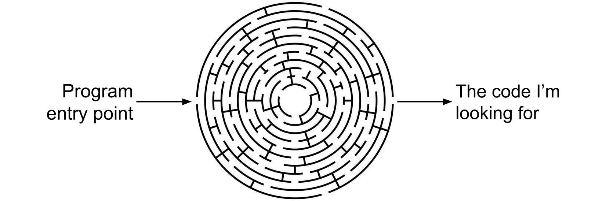
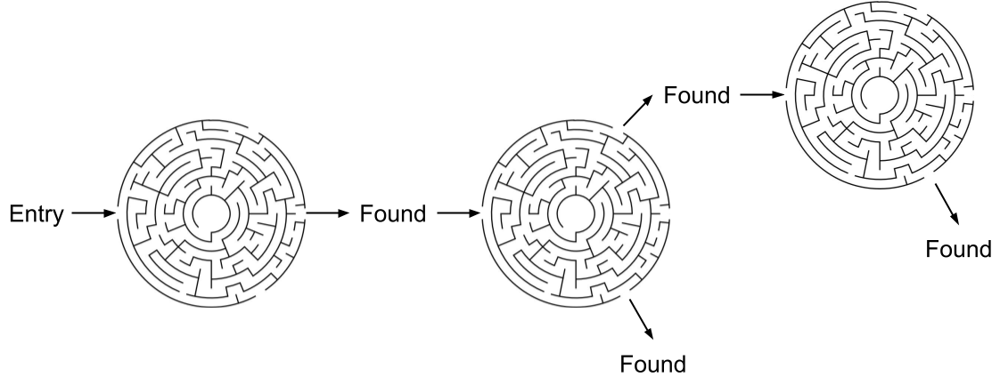
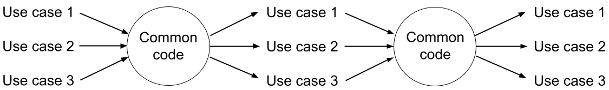
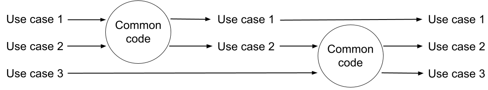
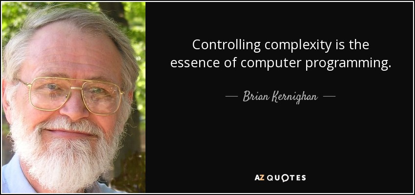

# Separate Use Cases

We are good programmers and we write good quality code. Despite that, I always struggle to find in the source code what I'm looking for. I usually feel like being in a maze. And it's worse: if I have found the demanded part, I lose it again... and again... and so on.











What happens here? What goes always wrong?

## The Common Code Problem

Programmers are notorious for pulling together similar code parts, saying they should avoid code repetition. Or that they should implement it on a more generic or abstract level.

Let's assume, we have two use cases consisting of similar but not equal steps:


Software developers will usually implement them in the following way:


That means that the common code will branch for the use cases, and then it goes again to the common code, then it will branch again.

With a simplified drawing—and rotating it with 90º—the following happens here:











Why is it bad? What is the problem? The problem is this:


The common code is not common!


The common part will contain different lines for the specific use cases again and again. So it is not really common. It is just "almost" common.


The common code should not be aware of the use cases at all.


The common code is often implemented in a parent class and the use cases are implemented in the child classes. But a parent class should not be aware of the children either.

## Solution

### Think in Sequences

Think of the program as a breakdown of the user requirements into features, use cases, and steps, where the use cases are made up by a pure _sequence of steps_, without branching.

Why is it good? Because it is much easier for the human mind to follow a sequence than several branchings.


What is the most simple and natural implementation of a sequence of steps? What would you expect, how it is implemented? The answer is:&#x20;


The most simple and natural implementation of a sequence of steps is a _sequence of method calls_, without any branching.


### Separate Instead of Merge

How to achieve that the common code does not contain branching for the use cases? Of course, at a certain point, the program has to make a distinction between the use cases. But after this point we should never merge them again:


How do we eliminate the code duplication of the common steps? We can simply extract the parts which are equal to more use cases:


So the rule is:


Extract common code only if it is exactly the same for the use cases and does not contain branching for them.


It also means that the extracted common code parts should be independent. They should be distinct methods or classes.

Of course, a common code can contain branching for _other_ use cases. But for those use cases, it should be again the only one place for branching.

### What to Merge And What Not

You should only extract into common function _how_ a certain step is implemented, and not extract _that_ a use case contains that step. The steps of a use case make its _description_. The steps of another use case should be the independent description of that other use case, even if they are similar.


The _naming rule_ can be helpful too: You should be able to add a meaningful, functional name to the extracted code. If it is not possible, then there is a chance that the code should not be extracted.

## Examples

### Simple Methods

We can do this anti-pattern with simple method calls. We pass the use cases to the common code and then it will make a distinction between them.

But instead of this, we should avoid branching in the common code, which would make the implementation of the use cases clearer. Which code implements the comment better?



```java
// Use case 1 = Step 1, Step 2
// Use case 2 = Step 2

enum UseCase {
	ONE, TWO
}

void useCase1() {
	common(ONE);
}

void useCase2() {
	common(TWO);
}

void common(UseCase useCase) {

	if (useCase == ONE) {
		step1();
	}

	step2();
}

void step1() {
}

void step2() {
}
```



```java
// Use case 1 = Step 1, Step 2
// Use case 2 = Step 2

void useCase1() {
	step1();
	step2();
}

void useCase2() {
	step2();
}

void step1() {
}

void step2() {
}
```



Note, that the `step1()` and `step2()` 'working' methods are the same. Only the _description of the use cases_ is different.

### Insider Information

This is also a way we write common code with non-separated use cases. We make decisions based on certain information, so it looks like data processing. But it just hides the real situation. In the next example the real meaning of the common code is this:

> If attribute1 is not null then this is use case 1.

So it re-creates the use cases based on internal information. This is potentially dangerous too, since it may change. It is like trading on a basis of insider information, which is illegal in real life.



```java
// Use case 1 = Step 1, Step 2
// Use case 2 = Step 2

void useCase1() {
	Data data = new Data("1", "1");
	common(data);
}

void useCase2() {
	Data data = new Data(null, "2");
	common(data);
}

void common(Data data) {

	if (data.getAttribute1() != null) {
		step1(data.getAttribute1() );
	}

	step2(data.getAttribute2() );
}

void step1(Object attribute1) {
}

void step2(Object attribute2) {
}
```



```java
// Use case 1 = Step 1, Step 2
// Use case 2 = Step 2

void useCase1() {
	Data data = new Data("1", "1");
	
	step1(data.getAttribute1() );
	step2(data.getAttribute2() );
}

void useCase2() {
	Data data = new Data(null, "2");
	
	step2(data.getAttribute2() );
}

void step1(Object attribute1) {
}

void step2(Object attribute2) {
}
```



```java
// Use case 1 = Step 1, Step 2
// Use case 2 = Step 2

void useCase1() {
	Data1 data = new Data1("1", "1");
	
	step1(data.getAttribute1() );
	step2(data.getAttribute2() );
}

void useCase2() {
	Data2 data = new Data2("2");
	
	step2(data.getAttribute2() );
}

void step1(Object attribute1) {
}

void step2(Object attribute2) {
}
```



```java
// Use case 1 = Step 1, Step 2
// Use case 2 = Step 2

void useCase1() {
	Data data = DataFactory.createForUseCase1("1", "1");
	
	step1(data.getAttribute1() );
	step2(data.getAttribute2() );
}

void useCase2() {
	Data data = DataFactory.createForUseCase2("2");
	
	step2(data.getAttribute2() );
}

void step1(Object attribute1) {
}

void step2(Object attribute2) {
}
```



Note, that the situation is the same as in the previous example, and the solution is also the same.

The most correct solution is, that if Use cases 1 and 2 use different data, then different data types should be created for them.

### Inheritance

We often do this common code mistake with abstract parent classes. Calling abstract methods is just an elegant way to hide the ifs/switches for the use cases, but they are still there! Each and every abstract method represents branching for the use cases.

It's even worse when we create multiple class hierarchies _for the same_ use cases. They are really the same branching again and again.


Multiple class hierarchies for the same use cases should be treated as code repetition.














Solution: we should create only one class hierarchy for the same use cases. Even better if we do not create any class hierarchies for them. The best is if we [Do Not Use Inheritance](../oop/do-not-use-inheritance.md) at all.

Putting common code into a parent class is a _misuse_ of inheritance because it generates unwanted dependencies between the classes. Common code should rather be _common functionality_, which should be put in independent components.

### Abstract Methods

We often use abstract methods only to return use case-specific values.



```java
abstract class Common() {

    void common() {
        
        if(getUseCase() == UC1) {
            step1();
        }
        
        step2();
    }
    
    abstract UseCase getUseCase();
}

class UseCase1 extends Common {

    @Override
    UseCase getUseCase() {
        return UC1;
    }
}

class UseCase2 extends Common {

    @Override
    UseCase getUseCase() {
        return UC2;
    }
}
```



```java
abstract class Common() {

    void common() {
        doUseCase();
    }
    
    abstract void doUseCase();
}

class UseCase1 extends Common {

    @Override
    void doUseCase() {
        step1();
        step2();
    }
}

class UseCase2 extends Common {

    @Override
    void doUseCase() {
        step2();
    }
}
```



```java
class UseCase1 {

    void doUseCase() {
        step1();
        step2();
    }
}

class UseCase2 {

    void doUseCase() {
        step2();
    }
}
```



Why is this another incorrect usage of inheritance? Actually, it is an incorrect usage of _methods_, which should be _procedures_ and not values. So the methods in the use case classes should directly call the specific methods instead of returning the use case.

### How to Control the Program Flow?

In all the above examples there is a common issue: we control the program flow with some information, which is passed as input parameter, abstract method, data, or in other ways.&#x20;

The following simplified code fragment shows where the `if` command controls the program flow:



```java
void method1() {
    method2(UC1);
}

void method2(UseCase useCase) {
    if(useCase == UC1) {
        doSomething();
    }
}
```



```java
void method2(UseCase useCase) {
    if(method1() == UC1) {
        doSomething();
    }
}

@Override
UseCase method1() {
    return UC1;
}
```



```java
void method1() {
  Data data = new Data("1", "1");
	method2(data);
}

void method2(Data data) {

	if (data.getAttribute1() != null) {
		doSomething(data.getAttribute1() );
	}
}

```



Why is it not optimal? Because in every example `method1()` _already knows_ the use case and it knows that `doSomething()` should be called. But it postpones that and leaves it to `method2()`. If `method2()` is a common function than it is _polluted_ by the branching between the use cases.


Never control the program flow with input parameters, abstract methods, or any fixed information, that is already known outside of the method.


Of course, branchings for the use cases should be implemented, but with the following rule:


Implement branchings for the use cases _only once_, and as _early as possible_.


## More Problems of Common Codes

### Too Many Ad-hoc Solutions

In the entire code base, there may be many other merged codes. The problem is that they are not logical, since they do not come from business logic. Instead, they are unexpected and arbitrary. Every common code has its specific logic that must be understood by each developer who works on that part. This leads to the problem that is described in [What Is The Problem With Abstract Frameworks?](../oop/what-is-the-problem-with-inheritance.md).

In other words, common codes dangerously increase the number of _dependencies_ between the classes. Dependencies make the code hard to understand and maintain.

The following image shows a logical breakdown of a program into features, sub-features, use cases, sub-use cases, and steps. Ad-hoc common code can be dropped anywhere between any similar parts. Note, that in real life it would be much more complicated.











### Common Code for Features

Note on the above image, that _features_ may also have common code, which is even worse than use cases having it.


Features must not have a common code.


Features should be entirely independent of each other. Otherwise modifying a feature would risk the breaking of other features, which are already tested and delivered.&#x20;

Not to mention that during the modifications of a program, features will have more and more differences, that must be added to the common parts, which adds unwanted complexity to the code.

### The Idea of Common Code

When writing object-oriented programs with many classes, the big question is always: where should I add my code? And the answer is: the new code should have a well-defined functionality, that helps to _name_ it, and then we can see where to add it.

Unfortunately 'common code' is not a name. It is not a functionality. We often create abstract parent classes for the common code. But 'Abstract' is not a name either, and abstraction is not a functionality.

Instead, when use cases or classes seem to have similar parts, we should analyze which _functionality_ they have in common and organize the code according to that.

## Summary

Why is the separation of use cases better than common code? We are never asked to modify 'common codes'. We always have to work on specific features and business requirements and that's what we want to see in the code.


In general, the goal is the separation, not the merge.


### Rules

**Extract** the implementation of _functionalities_ that are independent of the use cases, into a common code.

**Do not extract** the code, which is the _description of the use cases_, into a common code. Each use case should have its own distinct implementation, i.e. the description of the steps the use case consists of.

**Never** merge features into a common code. Features should be independent.

**Implement** branchings for the use cases _only once_, and as _early as possible_.

**Organize** and name the code by business logic, i.e. features, use cases, steps, and functions.

### Minimize Code Complexity

#### Minimize Branchings

Branchings increase _code complexity_. This is also known as [Cyclomatic complexity](https://en.wikipedia.org/wiki/Cyclomatic\_complexity). Every `if` or `switch` command, every abstract method, or descendant class is a branching. In a real-life program, there are countless of them! This makes the code very complex and hard to understand.

Investigate every `if` command and every possible branching, whether they are incorrect implementations of use cases, and rewrite them as shown above.

#### Minimize Dependencies

Common code creates a dependency between the classes. Dependencies also increase code complexity.




