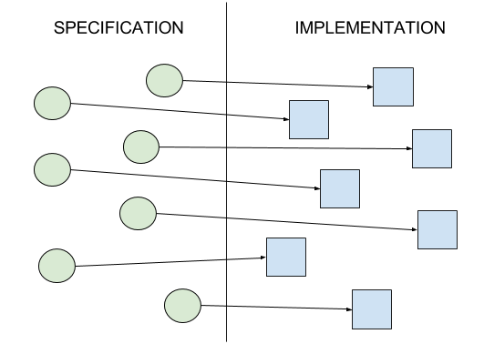
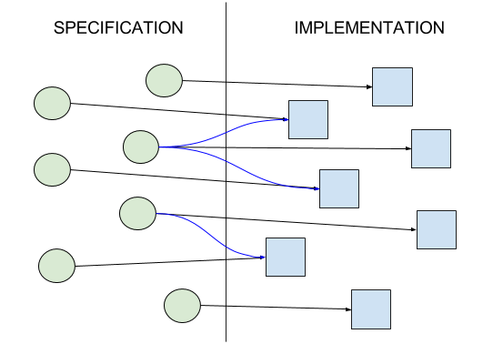
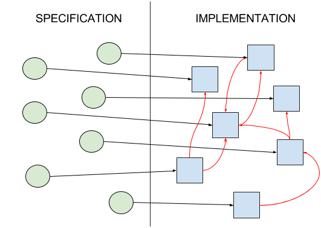

# The Real Single Responsibility Principle

This principle is probably the core rule of clean code since the _simplicity_ and _independence_ of the code can be reached by it.

It is also the letter S among the S.O.L.I.D. principles.

## The SRP

The original definition:


A class should have only one reason to change.


Later the word **reason** had been considered ambiguous so let's make it clear: the reason to change the code is only the change of the implemented functionality (specification).

And additionally, it is not only about a **class**. This rule can affect any part of the code on different levels. E.g. with Java terms, it can be a method, a class, a package, or an entire compilation unit (module).

## The extended SRP

For me it means the relation between one part of the specification and one part of the implementation:

But it still sounds incomplete because it sounds one-directional. It does not speak about the other direction: how many parts of the code should implement one piece of the specification. This is one of the big issues of software development, that we _implement one feature at several places_ throughout the code. This leads to higher complexity and less readability.

I have extended the rule with the bi-directional rules, so here is my complete SRP:&#x20;


* A code should change only if the implemented specification has changed.
* One part of the code should implement only one part of the specification.
* One part of the specification should be implemented by only one part of the code.


The last command can be formulated in another way so that you can imagine it better:

* When removing a functionality you are allowed to delete only one part of the code.:slight\_smile:

## Breaches of the SRP

### Ideal way

Ideally, the SRP could be imagined on this way:

### Spaghetti code

If one part of the specification is implemented in more parts of the code we talk about spaghetti code.&#x20;

You will recognize this when, in case of a functional change, many parts of the code must be modified.

### Unwanted dependencies

There is another common breach of the SRP, which is less obvious though it happens often.&#x20;

I call it "_an implementation is the reason of another implementation_", which does not comply with the rule above that the code should change only if the specification has changed.

It happens when there are too many dependencies between the code parts, which is usually caused by class hierarchies and [frameworks](oop/what-is-the-problem-with-inheritance.md) or other overcomplexity.

This leads to a very rigid code, which is hard to modify.

