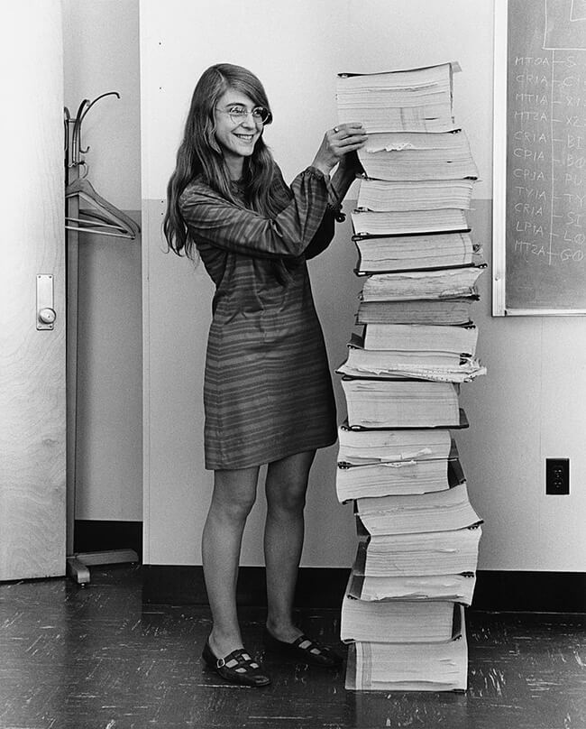

# The problem with Clean Code's name

## Clean?

Have you ever wondered why it is so hard to achieve that our source code is really a clean code? The problem may lie in Clean Code's name because it influences what we think about it.

Have you ever heard sentences like:

> My code is good but it's not clean.

or

> First it should work then we'll clean it later.

The word _clean_ sounds just to make the code 'nicer'. Developers may interpret it as 'code beautifying', a bothering and low priority activity. Which is, of course, a misunderstanding.

What if we would call it **Clear** Code? It would mean that _it is clear what the code does_. Which is exactly the goal of clean code. This main goal is, if I had to summarize it in one sentence, that it should be clear that the code implements the specification, and how it does that. That's what programmers are paid for: to implement the requirements of the customer.

Sentences like 'my code is not clear'—i.e. it is not clear what it does—would not sound so good anymore. 'Good but unclear' would be impossible. And it would also be easier to talk about _clarity issues_ than about cleanness issues.

## Code?

Another reason why the program will be hard to read is that it appears in the programmers' minds as _code_. It's a synonym for _cipher_, a text that is _encrypted_.

### Code

Let's have a look at some real code:



```
###############################################################################
# EXTRACT FROM THE CODE OF APOLLO 11, 1969
###############################################################################
GEOM            UNIT                    # MPAC=V2VEC, 0D=R1VEC          PL AT 6
                STODL   U2              # U2 (+1)
                        36D
                STOVL   MAGVEC2         #                               PL AT 0
                UNIT
                STORE   UR1             # UR1 (+1)
                DOT     SL1
                        U2
                PDDL                    # 0D=CSTH (+1)                  PL AT 2
                        36D
                STOVL   R1              # R1 (+29 OR +27)
                        UR1
                VXV     VSL1
                        U2
                BON     SIGN
                        NORMSW
                        HAVENORM
                        GEOMSGN
UNITNORM        STODL   UN              # UN (+1)
                        36D
                SIGN    RVQ             # MPAC=SNTH (+1), 34D=SNTH.SNTH (+2)
                        GEOMSGN

COLINEAR        VSR1    GOTO
                        UNITNORM

HAVENORM        ABVAL   SIGN
                        GEOMSGN
                RVQ                     # MPAC=SNTH (+1), 34D=SNTH.SNTH (+2)
                BANK    12
                SETLOC  CONICS
                COUNT   12/CONIC
```







### Language

But the programming languages we use today are so-called [high-level languages](https://en.wikipedia.org/wiki/High-level\_programming\_language), that aim for readability by humans. According to the [Clean Code book](clean-code/clean-code-outline/), the program should be readable like English prose. We ensure this by assigning and using _names_ of types, variables, and procedures.

> It's much easier for most people to write an English statement than it is to use symbols. So I decided data processors ought to be able to write their programs in English, and the computers would translate them into machine code. I could say 'Subtract income tax from pay' instead of trying to write that in octal code or using all kinds of symbols.&#x20;
>
> [Grace Hopper](https://en.wikipedia.org/wiki/Grace\_Hopper), inventor of compiler, COBOL, software standards, shared libraries, computer networks.

Here is an open-source example of the readable high-level language Java:

```java
/**
 * com.sun.awt.AWTUtilities
 */
public static boolean isTranslucencySupported(Translucency translucencyKind) {
    switch (translucencyKind) {
    case PERPIXEL_TRANSPARENT:
        return isWindowShapingSupported();
    case TRANSLUCENT:
        return isWindowOpacitySupported();
    case PERPIXEL_TRANSLUCENT:
        return isWindowTranslucencySupported();
    }
    return false;
}
```

### Translation

I suggest not to think of the program as a code, but rather as a _translation_ of the specification into the programming language. To be more precise, it is a translation into a _pseudo-language_, where the keywords of this language are the _names_ we have given.

Here we see a Hungarian poem and two texts in another language. Can you decide which one is the translation of the poem, without understanding a word?



**A Dunán**

Folyam, kebled hányszor repeszti meg \
Hajó futása s dúló fergeteg!

S a seb mi hosszu és a seb mi mély! \
Minőt a szíven nem vág szenvedély.

Mégis, ha elmegy fergeteg s hajó: \
A seb begyógyul, s minden újra jó.

S az emberszív ha egyszer megreped: \
Nincs balzsam, mely hegessze a sebet.



**Na Dunavu**

Reko, kako često rascepe ti grudi\
Hitre lađe i olujne studi.

I kako je rana duboka i duga! \
Takvu na srcu ne otvara tuga.

Ipak, kada prođu lađe, nepogode, \
Zarasta rana, mirno teku vode.

Al kad ljudsko srce prepukne ko reka, \
Nema za ranu balsama ni leka.



**Dunav**

Dunav je kroz povijest, a i danas, uvijek bio važan međunarodni plovni put. Dunav je dugo vremena bio i sjeveroistočna granica starorimske države. Rijeka danas teče kroz ili čini granicu deset država, a to su redom od izvora prema ušću: Njemačka (7,5 %), Austrija (10,3 %), Slovačka (5,8 %), Mađarska (11,7 %), Hrvatska (4,5 %), Srbija (10,3 %), Bugarska (5,2 %), Rumunjska (28,9 %), Moldavija (1,7 %) i Ukrajina (3,8 %). U riječni sustav Dunava spadaju i devet drugih država: Italija (0,15 %), Poljska (0,09 %), Švicarska (0,32 %), Češka (2,6 %), Slovenija (2,2 %), Bosna i Hercegovina (4,8 %), Crna Gora, Makedonija i Albanija (0,03).



Just by looking at the overall form of the texts, it is obvious that the first one is the translation of the original poem. We _expect_ that the correct translation looks like the first one.

Now imagine that the original text is the specification and the translation is its implementation in a programming language. We expect that it is easy to recognize the specification in the implementation. Once again the rule:


The program is a translation of the specification into another language.

